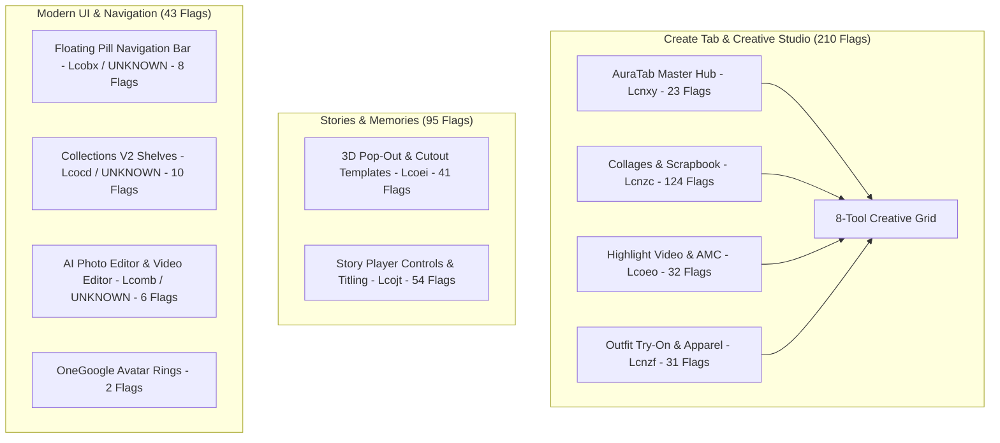

# Comprehensive Classification & Trigger Guide: 348 Morphe Flags

This document breaks down all **348 verified flags** present in the active Morphe profile (`morphe_user_with_8_tools.txt` / `.json`). It explains **which DEX class controls each group**, **what features they trigger**, and **how they interact to equip the 8 Creator Tab tools, Stories/Memories, and modern UI components**.

---

## Architecture & Subsystem Overview

The 348 flags are distributed across 6 major functional subsystems in Google Photos 7.94:

---

## 1. Create Tab: The 8 Creator Tools & Their Triggers (210 Flags)

The Create Tab tools grid is built by `Lqfc.d()`, which evaluates a strict set of flag conditions to decide whether each of the **8 tools** appears.

### Tool 1: Video Remix (`soba`)
* **Trigger Class**: `Lcnxy;` (`Lcnxx;`), `Laafq;` (`debug.photos.enable_bluejay_soba`), `Lqfc;->e`.
* **Required Flags**:
  * `45815130=true` (Remix creations master)
  * `45754248=true` (AuraTab hub)
  * `45748649=true` (Bluejay video processing pipeline)
* **What it does**: Enables AI video generation and styling from your video clips using the Soba engine.

### Tool 2: Photo Remix (`poptart` / `remix`)
* **Trigger Class**: `Lcnxy;` (`Lcnxx;`), `Lpxt;->V`, `Lqfc;->d`.
* **Required Flags**:
  * `45815129=true` (Made For You carousel)
  * `45815130=true` (Remix button)
  * `45833481=true`, `45833482=true`, `45833483=true` (Poptart / Remix generation models)
* **What it does**: Displays the Photo Remix card allowing text-prompt-based generative photo editing.

### Tool 3: Highlight Video (AMC)
* **Trigger Class**: `Lcoeo;` (`Lcoen;` — 32 Flags), `Lamts;` (`Lamoy;->c()`), `Lamtp;`.
* **Key Flags**:
  * `45398940=true` (`photos.movies.amc` — Automated Movie Creation)
  * `45459614=true` (`photos.movies.multi_asset_recipes`)
  * `45726376=true`, `45726377=true` (`recipes_preview_in_aura_tab` & chip suggestions)
  * `45426765=true` (`debug.photos.mrs_create_tab`)
  * `45408988=true` (`photos.movies.enable_highlight_video_rebranding_v2`)
* **What it does**: Adds the "Highlight video" tool card, enables automated soundtrack sync, smart clip selection, and recipe preview chips in the Create Tab header.

### Tool 4: Outfit Try-on (`outfit_try_on` / My Fits)
* **Trigger Class**: `Lcnzf;` (`Lcnze;` — 31 Flags), `Lacdg;->P()` (`bX: Lcboe`).
* **Key Flags**:
  * `45780002=true` (`debug.photos.enable_outfit_try_on_tool_chip`)
  * `45778389=true` (`debug.photos.enable_my_fits`)
  * `45781522=true` (`debug.photos.enable_my_fits_mvp`)
  * `45713555=true` (`debug.photos.enable_apparel_carousel`)
  * `45717505=true` (`debug.photos.enable_my_fits_outfit_suggestion`)
  * `45782800=true` (`debug.photos.enable_my_fits_flatlay_regeneration`)
  * `45767702=true` (`debug.photos.enable_apparel_outfit_info_sync`)
* **What it does**: Detects clothing items in your photos, organizes your virtual wardrobe ("My Fits"), and displays the "Outfit try on" card in the Create Tab tools grid.

### Tool 5: Collage (Stamp M2)
* **Trigger Class**: `Lcnzc;` (`Lcnzb;` — 124 Flags).
* **Key Flags**:
  * `3746=true`, `3768=true`, `3778=true` (Stamp Create Tab V2 & Collage M2 switches)
  * `45351199=true`, `45357121=true`, `45361103=true`, `45363145=true` (Multi-photo grid templates)
  * `45661840=true`, `45662058=true`, `45664048=true` (Dynamic cutout borders and art layouts)
  * `45773083=true`, `45773084=true`, `45818951=true` (Custom background graphic themes)
* **What it does**: Equips the "Collage" tool card with over 100+ modern artistic collage templates, dynamic borders, and custom background canvas layouts.

### Tool 6: Cinematic Photo
* **Trigger Class**: `Lcoeo;` (`photos.movies.cinematic_photo_creation_type`), `Ltap;->a()`, `Lakqv;`.
* **Key Flags**:
  * `45430236=true` (Cinematic Photo creation entrypoint in Create Tab)
  * `45418859=true` (Cinematic 3D parallax generation engine)
* **What it does**: Displays the "Cinematic photo" card, letting you pick any still photo to generate a 3D moving parallax shot.

### Tool 7: Animation (`animation`)
* **Trigger Class**: `Lwqh;->a()`, `Lqfc;->d()`.
* **Key Flags**:
  * `45353606=true`, `45694311=true` (Motion photo & frame extractor)
* **What it does**: Displays the "Animation" card for creating animated GIFs and moving loops from bursts or selected photos.

### Tool 8: Moods (`looks`)
* **Trigger Class**: `Lcnxy;` (`Lcnxx;`), `Lpxt;->v()`, `Lqfc;->d()`.
* **Key Flags**:
  * `45797840=true` (Moods master edit presets & artistic palettes)
  * `45754248=true`, `45754250=true` (AuraTab hub & hero header)
  * `45774010=true` (Storefront suggestion chips)
* **What it does**: Adds the "Moods" card and carousel in the Create tab, offering aesthetic color grade presets and instant photo styling.

---

## 2. Stories & Memories Engine (95 Flags)

### A. 3D Pop-Out Cutouts & Motion Templates (`Lcoei;` — 41 Flags)
* **`45477626=true`**: **3D Pop-Out & Pop-In Cutouts** — People and objects float and dynamically break out of the memory card frame.
* **`45659276=true`**: **3D Graphic Pop-Out Motion Templates** — Animated background graphics that move behind the subject.
* **`45742883=true`**: **3D Story Card Cutout Elevation Transitions** — Smooth 3D perspective shifts between story slides.
* **`45785531=true`**: **Cinematic Moments from Video** — Automatically extracts high-motion segments from long videos into memories.
* **`45764779=true`**: **Flying Memories Carousel (FMC) Scrubbing** — Ultra-fluid physics when swiping horizontally across memories.
* **`45659278=true`**: **Animated Pop-Out Sharing** — Exports memories with pop-out 3D cutout effects intact to Instagram/WhatsApp.
* **`3999=118109605`**: **Story Card Transition Timing** — Precise millisecond easing curves for slide transitions.

### B. Story Player Controls, Sound & Titling (`Lcojt;` — 54 Flags)
* **`45709355=true`**: **Story Sound & Music Playback** — Enables curated soundtrack streaming during full-screen story playback.
* **`45388291=true`**: **Bulk Story Titling & Custom Fonts** — Customize titles, date stamps, and font typography across memories.
* **`45357051=true`**: **Autoplay Badge Redesign** — Modern pill indicator showing autoplay progress and audio status.
* **`45737826=true`**: **Edge-to-Edge Swipe Navigation** — Modern Android 14/15 gesture transitions inside the story player.
* **`45662994=true`**: **Dynamic Pacing in Story Player** — Adjusts slide duration based on whether content is a portrait, landscape, or video clip.

---

## 3. Modern Navigation Bar & Layout (8 Flags)

* **`45732792=true`**: **Floating Navigation Bar (Master)** — Transforms the docked bottom bar into a floating Material You pill.
* **`45743215=true`**: **Date Capsule Floating Pill** — Displays a floating `[ Today ]` pill on the main grid that jumps directly to today's date.
* **`45746812=true`**: **Dynamic Elevation & Shadows** — Adds depth drop shadows that respond dynamically to scroll momentum.
* **`45745561=true`**: **Material You Dynamic Theming** — Extracts system Monet palette colors for the floating pill background.
* **`45753590=true`**: **On This Device Filter Pill** — Header pill to isolate local files from cloud-synced photos.
* **`45752831=true` & `45754546=true`**: **Reels Full-Screen Video Tab (V1 & V2)** — Vertical full-screen swipe video feed navigation.
* **`2892=true`**: **Fluid Grid Physics** — Smoother deceleration and spring-loaded scrolling on the photos feed.

---

## 4. Collections V2 Shelves & Organization (10 Flags)

* **`45762698=2`**: **Collections V2 Shelves Layout** — Upgrades the Library tab into categorized horizontal shelves (`0`=Off, `1`=Legacy, `2`=Full V2).
* **`45802110=2`**: **Collections V2 Content Activation** — Enables dynamic content populating in the shelves.
* **`45787397=true` & `3023=true`**: **Pinned Albums Shelf** — Lets you pin priority photo albums directly to the top shelf.
* **`45816328=true`**: **People & Pets Carousel** — Dedicated round-avatar shelf for favorite faces and pets.
* **`45794038=true`**: **Documents Shelf** — Automatically filters receipts, documents, whiteboard notes, and IDs.
* **`45794037=true`**: **Screenshots Shelf** — Isolate screenshots in a dedicated categorized tray.
* **`45821034=true` & `3013=1`**: **Modern Card Animations** — Smooth elevation and expand animations on album card taps.

---

## 5. AI Photo & Video Editor (6 Flags)

* **`45705305=true`**: **Magic Editor Gesture Selection** — Circle-to-select and tap-to-select objects inside Magic Editor.
* **`45683689=true`**: **AI Enhance V2** — Multi-stage neural network image enhancement for exposure, HDR, and detail.
* **`45709528=true`**: **Redesigned Video Editor (Varenyky Timeline)** — Multi-layer video editor with clip trimmer, speed adjustments, and audio overlay.
* **`45683026=true`**: **Video Thumbnail Seek Scrubbing** — Real-time thumbnail preview scrubbing above the video playback slider.
* **`45694311=true`**: **Motion Photo Stabilizer** — Software gyroscope stabilization for living photos.
* **`45353606=true`**: **Document Scanner Perspective Crop** — Automatic four-corner keystone correction when photographing paper documents.

---

## 6. OneGoogle Avatar Subscriber Rings (2 Flags)

* **`45531621=true`**: **Master Avatar Ring Switch** — Forces the Google One multi-color metallic ring around the top-right profile avatar.
* **`45531625=3`**: **Subscriber Ring Palette Variant** — Selects variant `3` (Premium iridescent 4-color gradient ring).
